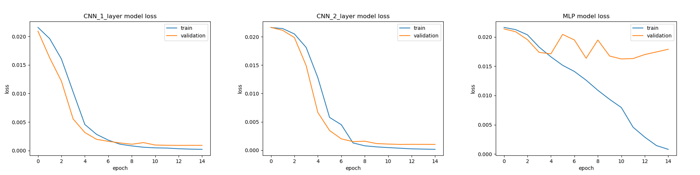
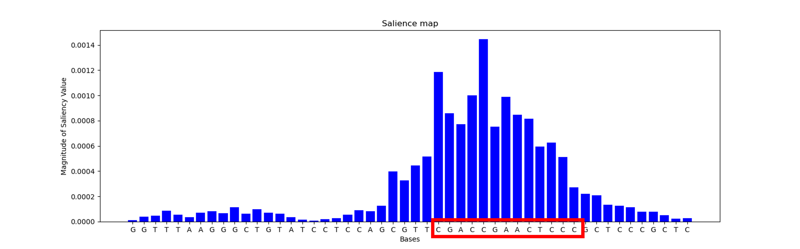

# Deep Learning Discovery Of Transcription Factor Binding Sites in DNA using Genomics Data 
The study of omics datasets using machine learning has revolutionized the potential for scientific discovery.
In this work, we consider various deep learning models to help identify the binding motifs in DNA based
on the results of an assay that determines whether a longer DNA sequence binds to the protein or not.
The dataset for this work comes from [1] and we build on the work this team developed. In particular, we study
the impact of different model architectures on making predictions and the interpretability of these models.

## Dataset
Our dataset consists of 2000 sequences of 50 bases each. This smaller dataset allows us to quickly study various
model types without the need for significant computing power. There are 987 positive samples and 1013 negative samples
in our dataset. A positive sample indicates a particular sequence will bind to the protein. The first goal
of our model is to determine this binding as a binary classification problem. From here we will develop methods
for studying which motif in our sequence was responsible for this classification. 

We split our dataset into train, validation, and test using a 60/20/20 ratio for model development. The data is one-hot
encoded using the 4 base types (ACGT). 

## Methods
We consider training of various model architectures. In particular, we consider a 1-layer CNN, a 2-layer CNN, and a
multilayer-perceptron. Our CNN is a 1D convolutional layer which is commonly used in functional genomics applications. Unlike
traditional computer vision applications, we don't see better results by building deeper models. Instead, we study
more shallow model architectures in this study. 

For training, we use the BCELoss with a SGD optimizer. We train all models for 15 epochs, which is sufficient
as seen by our training curves. After the model is trained, the goal is to identify which portions of the input sequence resulted in the prediction.
This helps us find the corresponding motif. To perform this, we use saliency maps to backpropogate the gradients
from the predictions.

## Results
The results of the impact of various model architectures on our test dataset accuracy is seen below. Note, from
our dataset section we know our samples are not skewed in either direction and thus this accuracy score is representative
of our results. Further confusion matrices can be built to show the mis-classification errors. 

|                 | **Test Accuracy (%)** |
|-----------------|:---------------------:|
| **1 Layer CNN** |         99.7          |
| **2 Layer CNN** |         100.0         |
| **MLP**         |         79.3          |

The training curves are shown here below for the three different models. Notice how both the 1-layer and 2-layer
CNN seem to have the validation and training losses as similar during the entire process. The 2-layer CNN looks to take
longer to train; however from the above table we see we get better learning with the increased model depth. On the other hand, we
notice the MLP is over-fitting early on. This could be mitigated in future trials with smaller networks, dropout, or
other forms of regularization. 

Using our best model (2-layer CNN) we decide to generate the saliency maps. This is shown for one of the 
positive samples in our dataset in the below figure. Note there is a small portion of this entire sequence that
seems to have high magnitude. If we look at our other samples, we find this is the same exact sequence that is
resulting in our positive prediction. (These bases are boxed in red in the figure below). This then helps us infer that 
the corresponding motif that results in the protein binding is the sequence "CGACCGAACTCC".

## Repository Breakdown
This repository includes the following files to replicate our work.
1. main.py: the core driving program for training the models and reporting the results
2. methods_and_networks/: a subfolder including files for our models, data preprocessing, and various helper functions that are called in the main.py
3. figures/: a subfolder where our results are saved as they are plotted during training.

## References
[1] Zou, J., Huss, M., Abid, A. et al. A primer on deep learning in genomics. Nat Genet 51, 12–18 (2019). https://doi.org/10.1038/s41588-018-0295-5

